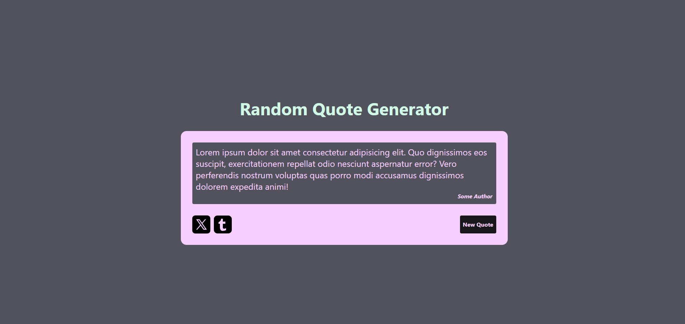

# Random Quote Machine

This is a solution to the Random Quote Machine challenge on freeCodeCamp.

---

## Table of contents

- [Overview](#overview)
    - [The challenge](#the-challenge)
    - [Screenshot](#screenshot)
    - [Links](#links)
- [My process](#my-process)
    - [Built with](#built-with)
    - [What I learned](#what-i-learned)
- [Author](#author)

---

## Overview

### The challenge

Users should be able to:

- View a random quote on page load
- Generate a new random quote when clicking the **"New Quote"** button
- Share the current quote on X (Twitter)
- Share the current quote on Tumblr

---

### Screenshot



---

### Links

- Solution URL: [Github repo](https://github.com/S4V10N/random-quote-machine.git)
- Live Site URL: [Live preview](https://random-quote-machine-three-delta.vercel.app/)

---

## My process

### Built with

- React
- Tailwind CSS
- Semantic HTML5 markup
- Vite

---

### What I learned

This project helped me strengthen my understanding of:

- React state management using `useState`
- Handling dynamic data rendering
- Encoding URLs for social media sharing
- Preventing repeated quotes consecutively
- Building responsive layouts with Tailwind
- Implementing external share links (X & Tumblr)

Below is a key snippet used to generate and encode shareable quote text:

```js
const shareText = `"${quote.text}" — ${quote.author}`;
const encodedText = encodeURIComponent(shareText);

const tweetUrl = `https://x.com/intent/tweet?text=${encodedText}`;

const tumblrUrl = `https://www.tumblr.com/widgets/share/tool?posttype=quote&tags=quotes&caption=${encodeURIComponent(
    quote.author,
)}&content=${encodeURIComponent(quote.text)}`;
```

## Author

- Website [S4](https://savion.dev)
- Frontend Mentor [S4V10N](https://www.frontendmentor.io/profile/S4V10N)
- Twitter [Dev Savion](https://x.com/dev_savion?s=21)
